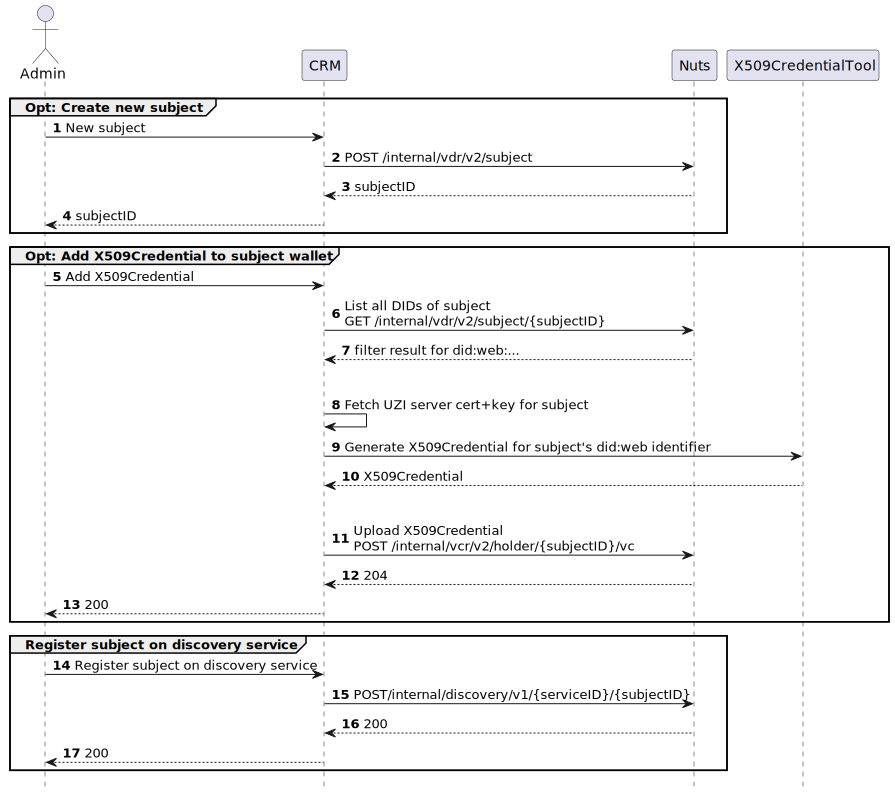
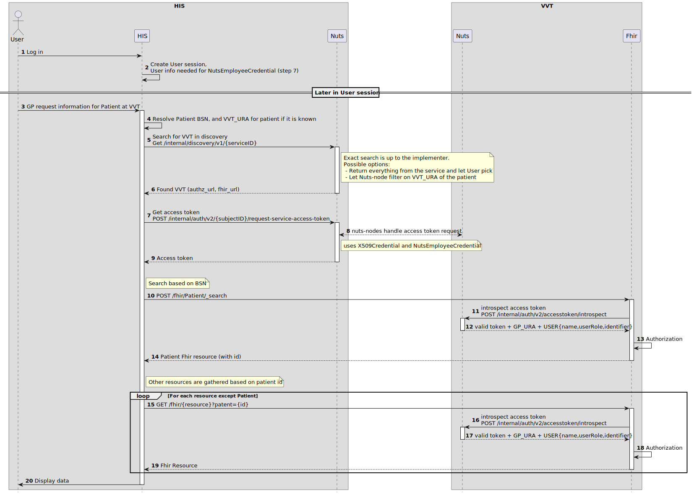

# Scope
## Doel
Het doel van deze toepassing is tweeledig: het verbeteren van de informatievoorziening van de huisarts die behoefte heeft aan informatie over wat er in het VVT domein met de patient gebeurt en het optimaliseren van het werkproces van een verleegkundige die belast is met de taak om de huisarts waar nodig op de hoogte te houden.
  
In de huidige situatie wordt de huisarts daarover vaak geinformeerd doordat de VVT-medewerker een dubbele administratie bijhoudt in het eigen systeem (ECD) en dat de huisarts (HIS of samenwerkingsplatform). Deze toepassing beschrijft de techniek waarmee het mogelijkl wordt voor de huisarts om rechtstreeks de informatie uit het ECD te raadplegen vanuit het eigen systeem.

## Scope:
Inzage door de huisarts is fase 1 van een veel bredere en rijkere integratie. Hierbij gaat het om informatie 'de andere kant op' en het uitzetten van taken. Deze functionaliteiten worden in latere versies van deze usecase toegevoegd.

# Governance
De Governance en besluitvorming rondom deelname is belegd bij de projectgroep Huisarts inzage.

# Functioneel Ontwerp
Deze usecase ondersteunt het ophalen van informatie zoals vastgelegd door de (wijk)verpleging in de VVT om deze informatie beschikbaar te stellen aan de huisarts. Het proces werkt als volgt:

De huisarts wil informatie inzien in het bronsysteem (VVT). In het huisartsensysteem start de gebruiker de zoekopdracht. Gezocht wordt op een individuele patient. Gebaseerd op de informatie die door de VVT instellingen in de discoveryservice is vastgelegd in combinatie met het BSN van de patient wordt in het opvragende systeem een lijst getoond van instellingen waar potentieel informatie op te halen is voor de betreffende patient. De huisarts selecteert de juiste instelling. Op basis daarvan vindt een FHIR-request 'Patient' plaats naar het bronsysteem. Het bronsysteem beoordeelt deze op een aantal parameters:

* Ken ik deze patient?
* Heeft deze patient een consent afgegeven?
* Klopt het Verifiable Credential van de aanvrager (geldig en gelijk aan hetgeen is vastgelegd bij de patient)?
* Is deze huisarts onderdeel van het zorgnetwerk van deze patient?

Als middel wordt hiervoor het URA nummer van de opvragende organisatie gebruikt. Deze informatie is door de (wijk)verpleging vastgelegd in het bronsysteem bij de patiënt. 

Indien er informatie beschikbaar is en deze vrijgegeven mag worden wordt het interne PatientID terugekoppeld aan het opvragende systeem. Hierin is ook de informatie opgenomen rondom de contactinformatie van de zorgverlener. Hiermee kan de vraag beantwoord worden 'wie moet ik bellen voor deze patient'.

Op basis van dit PatientID kan verdere (medisch inhoudelijke) informatie opgevraagd worden. Er is een lijst beschikbaar van informatie die opgevraagd kan worden indien het bronsysteem deze informatie beschikbaar heeft. Deze bestaat uit rapportages en meetwaarden volgens een afgesproken stramien (in aantal / tijd). Zie hiervoor de 'Tabel met FHIR resources en queries' onder paragraaf 'Informatie'.

De verdere medisch inhoudelijke informatie wordt opgehaald op basis van FHIR (ZIB's waar mogelijk). De informatie wordt in het doelsysteem getoond. Het doelsysteem is er verantwoordelijk voor de informatie in de juiste context te tonen (denk aan verschillen met eigen informatie). Indien gewenst kan informatie overgenomen worden / opgeslagen in het doelsysteem,

Logging vindt in de gehele keten plaats.

# Uitgangspunten
De cliënt is reeds bekend/in zorg bij zowel de huisarts als bij de VVT instelling

De client heeft consent afgegeven om data te delen met de huisarts

Informatie kan opgehaald worden bij het bronsysteem en vastgelegd in het doelsysteem

Er is een lijst beschikbaar van informatie die opgehaald kan worden

De medewerkers blijven in hun eigen systeem werken. De leveranciers zijn zelf verantwoordelijk hoe zij de medewerker het beste willen/kunnen ondersteunen.

Er wordt gebruik gemaakt van bestaande zorginformatiebouwstenen die voor de leveranciers al bekend zijn. Hierbij wordt FHIR versie van de eOverdracht gebruikt: FHIR STU3.

Het afhandelen van de cobsentvraag vindt plaats in het bronsysteem. Het systeem bepaalt zelf hoe dit vastgelegd wordt en hoe het gecheckt wordt

Authenticatie vindt plaats op basis van een Verifiable Credential: het URA nummer van de organisatie waar de opvrager werkt en zoals vastgelegd in een UZI Servercertificaat.

Autorisatie vindt plaats door een check te doen of het VC in lijn is met wat er is vastgelegd bij de patient in het bronsysteem

Ten behoeve van logging wordt door het doelsysteem het MedewerkerID van de opvrager meegegeven. Deze informatie wordt bij de aanvraag vastgelegd.

Logging vindt in de gehele keten plaats

Shortcuts en Toekomstige ontwikkelingen:
Sommige zaken kunnen we op dit moment niet invullen zoals we willen omdat dit (om verschillende redenen) nog niet realistisch. Deze zaken plaatsen we in deze usecase buiten scope en worden later eventueel toegevoegd. Het gaat om:
* Consent lokaal oplossen (ipv Mitz)
* met UZI certificaat (nog geen goed authenticatiemiddel voor de gebruiker beschikbaar / DEZI)
* Toekomstige ZIB's (nu niet beschikbaar in bronsystemen)
* DPOB security (is aanvullende beveiliging die ook in andere usecase niet ingevuld)
* UZI credentials (human readable namen) moet bij de bron opgelost worden
* Lokalisatie (bij gebrek aan een generieke lokalisatiedienst)

## Architectuurbeschrijving

### Registreren voor de use-case
<!--  -->

**X509CredentialTool**: 
De Nuts community biedt op dit moment 2 tools aan om een X509Credential te genereren:
- Een [Java library](https://github.com/nuts-foundation/uzi-did-x509-issuer-java)
- Een [Go tool en docker image](https://github.com/nuts-foundation/go-didx509-toolkit)

Beide tools geven instructies om stappen 9-10 uit te kunnen voeren.

### Data ophalen bij de VVT
<!--  -->

TODO: write out actions for each (group of) steps

## Lokalisatie
Bij gebrek aan een generieke lokalisatiedienst wordt lokalisatie lokaal ingevuld. Dit houdt in dat er in de systemen zelf bijgehouden wordt waar data opgehaald kan worden. Bijvoorbeeld door de VVT instelling waar de patient bij in behandeling is expliciet vast te leggen. 

## Grondslag
Voor de behandelrelatie wordt ervan uitgegaan dat als de huisarts is vastgelegd bij de patient in het VVT dossier, er sprake is van een behandelrelatie.

### Consent specificatie
Consent: de verantwoordelijkheid voor het vastleggen en checken van consent wordt ingevuld door het bronsysteem zelf.

## Adressering
Discovery Service

### Discovery Definition

Algemene uitleg over wat is een Service Discovery is te vinden op de [Nuts Wiki pagina Service Discovery](https://wiki.nuts.nl/books/designing-a-nuts-use-case/page/service-discovery)

#### Input descriptors:
Qua benodigde credentials kennen wij 2 verschillende credentials, een X509Credential en een DiscoveryRegistrationCredential.

##### X509Cerdential
Dit betreft een X509Credential conform [Nuts RFC023](https://wiki.nuts.nl/books/x509credential/page/uzi-server-certificates-with-rfc023), ondertekend met een UZI-servercertificaat.

Aanmaken kan bijv. met de [go-didx509-toolkit](https://github.com/nuts-foundation/go-didx509-toolkit/tree/main). Als uitgever is besloten om hier de chain op te nemen het dichtst bij de leaf-certificaat.

Gezocht kan worden op de naam van de DID, organisatie naam, plaats & URA.

##### DiscoveryRegistrationCredential
Dit betreft een DiscoveryRegistrationCredential conform de uitleg op de [Nuts Wiki pagina over Service Discovery](https://wiki.nuts.nl/books/designing-a-nuts-use-case/page/service-discovery#bkmrk-require-registration).

Hierbij is een veld toegevoegd aan de credentialSubject genaamd fhirBaseURL. Deze kan gebruikt worden door gebruikers van de Discovery Service om te weten waar de daadwerkelijke FHIR data opgehaald kan worden.

## Authenticatie
Om veilig gegevens te kunnen delen tussen verschillende zorgaanbieders, is zorgaanbieder-overstijgende authenticatie van zorgorganisaties en zorgverleners essentieel. Vanuit de NEN wordt gewerkt aan een norm met betrekking tot identificatie en authenticatie. Op het moment dat deze norm gepubliceerd wordt zullen we de landelijke ontwikelingen mbt tot deze norm volgen. Om op korte termijn informatie uitwisseling mogelijk te maken, zal de authenticatie geborgd worden op de volgende manier:

### Server & Client authenticatie
Voor server & client authenticatie is besloten om de volgende uitgangspunten te hanteren:
- Testomgevingen maken gebruik van Test UZI-servercertificaten voor de X509Credentials & geldige certificaten voor TLS (publiekelijk vertrouwde & PKIOverheid) op de FHIR endpoints en als clientAuthenticatie
- Acceptatieomgevingen maken gebruik van of test of productie UZI-servercertificaten voor de X509Credentials & PKIOverheid voor TLS op de FHIR endpoints en als clientAuthenticatie
- Productieomgevingen maken enkel gebruik van productie UZI-servercertificaten voor de X509Credentials & PKIOverheid voor TLS op de FHIR endpoints en als clientAuthenticatie

## Identificatie
Om de raadplegende organisatie te identificeren wordt gebruik gemaakt van het UZI abonnenumummer ook wel bekend als het URA nummer. Als middel voor de authenticatie van dit nummer gebruiken we een verifiable credential en de OpenID Foundation standaarden voor authenticatie.

Omdat het UZI register als authentieke bron zelf nog geen URA Credentials uitgeeft wordt dit credential afgeleid van een UZI Servercertificaat van de betreffende organisatie. We gebruiken hiervoor een nieuw credential NutsX509Credential waarvan de ontwikkeling hier te volgen is: https://github.com/nuts-foundation/nuts-node/issues/3582

### Policy Definition

#### Input descriptors:
Qua benodigde credentials kennen wij 2 verschillende credentials, een X509Credential en een NutsEmployeeCredential.

##### X509Credential
Zie de X509Credential onder Discovery Definition, deze is exact het zelfde.

##### NutsEmployeeCredential
Zie de [Nuts Wiki pagina over Requesting Access](https://wiki.nuts.nl/books/implementing-a-nuts-use-case-Ssg/page/requesting-access) voor context.

## Autorisatie
Voor fase 1 van de Huisartsinzage gaan wij uit van autorisatie op 4 niveaus:
- Behandelrelatie
- Consent
- Zib
- Fhir query parameters

#### Behandelrelatie
Om toegang te krijgen tot gegevens van een patient is het vereist dat er een behandelrelatie tussen de huisartspraktijk en de patient bekend is bij het bronsysteem. Deze controle wordt gedaan op basis van het URA-nummer waarmee een resource wordt opgehaald. Dit nummer is terug te vinden in het `organization_ura` veld van een token introspect op de Nuts node. Zie ook stap 11 in "Request data at VVT" onder de architectuurbeschrijving.

#### Consent
Om een resource van een patient op te kunnen halen moet het bronsysteem toestemming van de patient geregistreerd hebben of op kunnen halen. Een algemene toestemming volstaat hier, waarbij de patient toestemming geeft om zijn of haar gegevens te delen met huisartsen.

#### Zib
Voor de Huisartsinzage is een beperkte set aan Zibs beschikbaar. Deze zijn uitgewerkt in de lijst van ZIBs. Alleen deze Zibs kunnen opgehaald worden binnen de scope van de Huisartsinzage.

#### Fhir query parameters
Om te voorkomen dat er teveel informatie opgehaald kan worden (bijvoorbeeld middels het gebruik van `_include` parameters) wordt er ook autorisatie uitgevoerd op basis van de gebruikte query parameters. Hier wordt onderscheid gemaakt tussen verplichte parameters en toegestane parameters. Alle query parameters die gedefinieerd zijn in de set aan gebruikte Zibs (zie hieronder) zijn verplicht. Het gebruik van andere query parameters is niet toegestaan.

## MedewerkerID
Uitgangspunt: Identificatie van de medewerker op basis van een (intern) MedewerkerID, gecombineerd met een VC gebaseerd op informatie binnen het UZI-servercertificaat.

## Informatie
### Lijst van ZIBs

### Tabel met FHIR resources en queries
Hieronder staan de endpoints die beschikbaar gesteld moeten worden door de partijen die toegang tot het ophalen van de informatie in het VVT domein verlenen. Ter verheldering zijn de kolommen Sort en Count toegevoegd om
aan te tonen hoeveel resultaten er geretourneerd worden en op welke manier deze worden gesorteerd. Het is van belang dat bij een aanroep alle parameters gebruikt worden die in de tabel staan en ook geen extra. Dit heeft te maken met de
controle die de systemen doen op de verifiable credentials. Die controle wordt op die manier gedaan om te voorkomen dat
met een parameter zoals een include extra gegevens meekomen.

| ZIB                 | Method | Sort      | Count | Endpoint                                                                                                                            | Profiel                                                                                                                                                              |
|:--------------------|--------|-----------|-------|:------------------------------------------------------------------------------------------------------------------------------------|:---------------------------------------------------------------------------------------------------------------------------------------------------------------------|
| Alerts              | GET    |           |       | /fhir/Flag?patient={patientId}}&_profile=http://nictiz.nl/fhir/StructureDefinition/zib-Alert                                        | [https://simplifier.net/packages/nictiz.fhir.nl.stu3.zib2017/2.2.10/files/1954733](https://simplifier.net/packages/nictiz.fhir.nl.stu3.zib2017/2.2.10/files/1954733) |
| Allergie            | GET    |           |       | /fhir/AllergyIntolerance?patient={patientId}&_profile=http://nictiz.nl/fhir/StructureDefinition/zib-AllergyIntolerance              | [https://simplifier.net/packages/nictiz.fhir.nl.stu3.zib2017/2.2.18/files/2317138](https://simplifier.net/packages/nictiz.fhir.nl.stu3.zib2017/2.2.18/files/2317138) |
| Bloeddruk           | GET    | Date DESC | 5     | /fhir/Observation?patient={patientId}&_profile=http://nictiz.nl/fhir/StructureDefinition/zib-BloodPressure&_sort=-date&_count=5     | [https://simplifier.net/packages/nictiz.fhir.nl.stu3.zib2017/2.2.10/files/1954744](https://simplifier.net/packages/nictiz.fhir.nl.stu3.zib2017/2.2.10/files/1954744) |
| Lichaamsgewicht     | GET    | Date DESC | 5     | /fhir/Observation?patient={patientId}&_profile=http://nictiz.nl/fhir/StructureDefinition/zib-BodyWeight&_sort=-date&_count=5        | [https://simplifier.net/packages/nictiz.fhir.nl.stu3.zib2017/2.2.10/files/1954750](https://simplifier.net/packages/nictiz.fhir.nl.stu3.zib2017/2.2.10/files/1954750) |
| Lichaamslengte      | GET    | Date DESC | 5     | /fhir/Observation?patient={patientId}&_profile=http://nictiz.nl/fhir/StructureDefinition/zib-BodyHeight&_sort=-date&_count=5        | [https://simplifier.net/packages/nictiz.fhir.nl.stu3.zib2017/2.2.10/files/1954746](https://simplifier.net/packages/nictiz.fhir.nl.stu3.zib2017/2.2.10/files/1954746) |
| Lichaamstemperatuur | GET    | Date DESC | 5     | /fhir/Observation?patient={patientId}&_profile=http://nictiz.nl/fhir/StructureDefinition/zib-BodyTemperature&_sort=-date&_count=5   | [https://simplifier.net/packages/nictiz.fhir.nl.stu3.zib2017/2.2.10/files/1954748](https://simplifier.net/packages/nictiz.fhir.nl.stu3.zib2017/2.2.10/files/1954748) |
| Patiënt             | POST   |           |       | Zie onder de tabel                                                                                                                  | [https://simplifier.net/packages/nictiz.fhir.nl.stu3.zib2017/2.2.10/files/1954638](https://simplifier.net/packages/nictiz.fhir.nl.stu3.zib2017/2.2.10/files/1954638) |
| Respiration         | GET    |           |       | /fhir/Observation?patient={patientId}&_profile=http://nictiz.nl/fhir/StructureDefinition/zib-Respiration&_sort=-date&_count=5       | [https://simplifier.net/packages/nictiz.fhir.nl.stu3.zib2017/2.2.10/files/1954947](https://simplifier.net/packages/nictiz.fhir.nl.stu3.zib2017/2.2.10/files/1954947) |
| TekstRapportage     | GET    | Date DESC | 10    | /fhir/Observation?patient={patientId}&_profile=https://nuts.nl/fhir/StructureDefinition/nl-core-nursingreport&_sort=-date&_count=10 | [https://simplifier.net/anw/nl-core-nursingreport](https://simplifier.net/anw/nl-core-nursingreport)                                                                 |
| Wilsverklaring      | GET    |           |       | /fhir/Consent?patient={patientId}&_profile=http://nictiz.nl/fhir/StructureDefinition/zib-AdvanceDirective                           | [https://simplifier.net/packages/nictiz.fhir.nl.stu3.zib2017/2.2.10/files/1954726](https://simplifier.net/packages/nictiz.fhir.nl.stu3.zib2017/2.2.10/files/1954726) |
| Woonsituatie        | GET    |           |       | /fhir/Observation?patient={patientId}&_profile=http://nictiz.nl/fhir/StructureDefinition/zib-LivingSituation                        | [https://simplifier.net/packages/nictiz.fhir.nl.stu3.zib2017/2.2.10/files/1954848](https://simplifier.net/packages/nictiz.fhir.nl.stu3.zib2017/2.2.10/files/1954848) |

Voor het ophalen van de Patiënt geldt:
POST /fhir/Patient/_search
- Header: Content-Type = x-www-form-urlencoded (zie https://www.hl7.org/fhir/http.html#search-post)
- Body: identifier=http://fhir.nl/fhir/NamingSystem/bsn|{bsn}
- Optionele parameters:
  - `_include=Patient:general-practitioner`
  - `_include:iterate=PractitionerRole:organization`

## Foutafhandeling
In deze fase concentreren we ons op beveiliging – juist in de pilot zal bekeken moeten worden of dit ook leidt tot voldoende gebruiksgemak. In de basis wordt dus alleen getoond DAT er een fout is en geen specifiekere informatie zoals 'patient niet gevonden'. Informatie die publiekelijk beschikbaar is (bv inhoud van de usecase als zijnde 'deze resource valt buiten de usecase') zou toegevoegd mogen worden om nieuwe ontwikkelaars makkelijker te maken bij het testen

## Versiebeheer
Wordt momenteel uitgewerkt in usecase ANW. Resultaat wordt hier opgenomen

## Omgevingen
De volgende omgevingen zijn beschikbaar in de OTAP omgeving:
-Ontwikkel: lokaal bij de ontwikkelaars zelf
-Test: Testomgeving waar met UZI testcertificaten gewerkt wordt
-Acceptatie: acceptatieomgeving
-Productie: productie omgeving
Voor alle omgevingen is specifieke inrichting nodig, deze is hier te vinden: 
